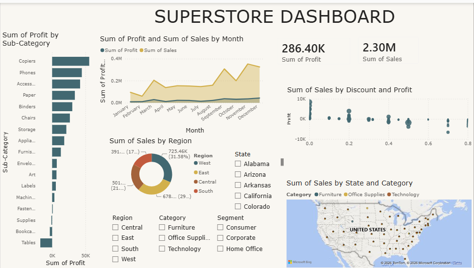

# Superstore Sales Performance Dashboard

This project is an interactive Power BI dashboard that presents a comprehensive overview of superstore's sales performance across various dimensions including product categories, regions, sales trends over time, and profitability. 

## Overview
This dashboard helps identify sales trends, top-performing products, regional performance, and profitability opportunities.

## Tools Used
- Power BI Desktop
- DAX
- Superstore Dataset

## Key Insights
- Strong overall sales performance
- Notable opportunities in specific sub-categories
- Discount strategies impacting profitability

## Dashboard Preview

## How to View the Dashboard
1. Download the `.pbix` file
2. Open it with "Power BI Desktop".
3. Alternatively, view the screenshots above for a quick overview.

